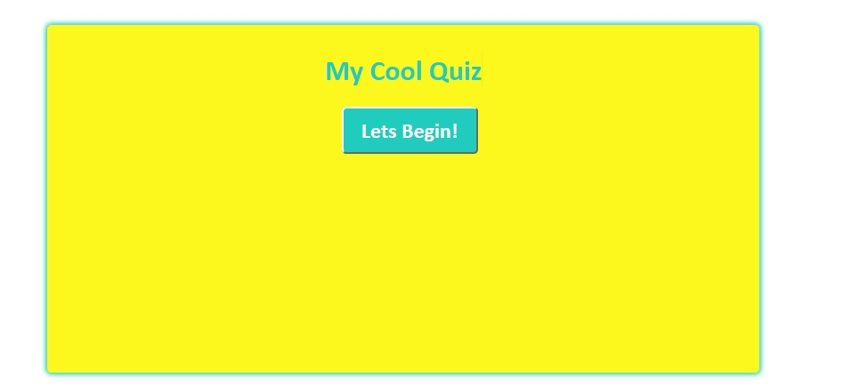

### Quiz Instructions ####

1 Click start button to begin. 

2 Once questions have appeared. Select what you believe is the correct answer.

3 Green = Correct, Red = Wrong.. 

4 Then select next button to move to the next question.

5 Repeat until all questions are answered.

## Features I plan to add on sound effects for clicking answers. A timer to show how long the quiz took. 
##  After 6 week of intesive learning at the Tech Talent Accelerator programme lead by Generation.
## For my final project I wanted to challenge myself so I decided to create a quiz using mainly javascript. I have proven to myself that I can do anything I put my mind to. 

### I used trello to write down my plan https://trello.com/b/kHrx5kc3/quiztime

## Check out my screenshot of my project. I am continuing to build and develop my quiz untils I have completed my checklist on trello.  
